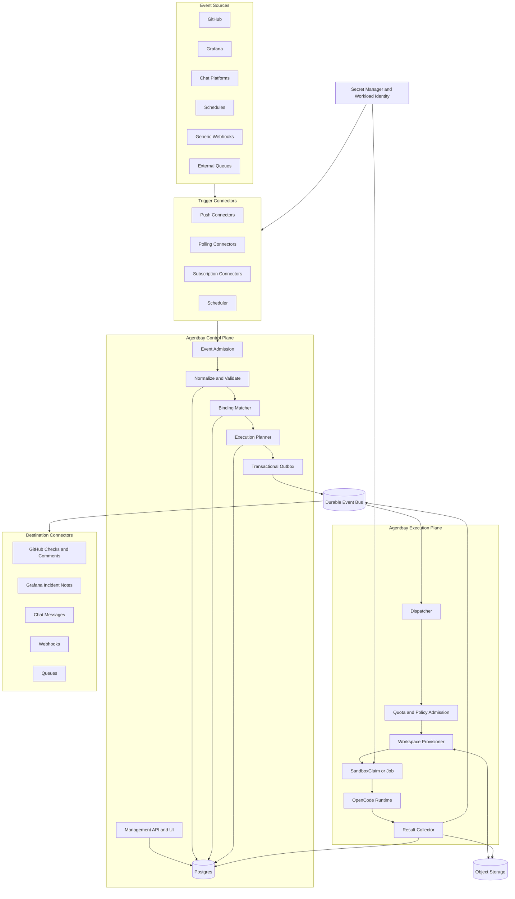

# agentbay - Architecture and Product Definition

> **Status:** Source of truth for agentbay architecture.
> **Audience:** Engineers, operators, agent authors, and AI coding agents contributing to this repository.

## 1. Definition

**agentbay is a platform for event-driven asynchronous agents.**

An immutable agent definition is invoked by an event through an enabled immutable binding version, runs asynchronously in an isolated workspace, and publishes durable results.

Agent authors configure agents deeply through native OpenCode configuration: models, providers, prompts, tools, MCP servers, permissions, and runtime behavior. Operators bind those agents to external events such as pull requests, issues, Grafana alerts, schedules, chat messages, queues, and generic webhooks. Agentbay admits and persists those events, plans durable executions, and runs them in isolated Kubernetes workloads at large scale.

Chat is one trigger and result destination among many. Kubernetes is the execution substrate, not the product model.

### 1.1 Core promise

| Audience | Promise |
|---|---|
| Agent authors | Define a capable OpenCode agent once, version it, and invoke it from many event sources. |
| Integration authors | Add triggers and result destinations through small, stable connector contracts. |
| Platform operators | Run agents with explicit quotas, identities, credentials, network policy, retention, and auditability. |
| Application teams | Turn operational and development events into asynchronous, observable agent work without owning agent infrastructure. |
| End users | Receive useful results where work already happens: GitHub, Grafana, chat, ticketing systems, or APIs. |

### 1.2 Non-goals

Agentbay is not:

- A new agent runtime. OpenCode owns the agent loop and native agent configuration.
- A general-purpose workflow engine. Agentbay may integrate with one when durable multi-stage workflows justify it.
- A chat bot framework. Chat is an integration, not the architecture.
- A Kubernetes operator as its primary product API. Users reason about events, agents, and executions, not Pods.
- A source of truth for secrets. It references credentials managed by a secret manager or workload identity system.
- An exactly-once distributed system. It provides effective-once behavior on top of at-least-once delivery.

## 2. Guiding Principles

1. **Events are inputs, not conversations.** A conversation may emit events, but no chat-specific abstraction belongs in the execution core.
2. **Executions are durable records, not handler calls.** Every accepted invocation remains inspectable and recoverable across process failures.
3. **Profiles are immutable capability definitions.** Every execution resolves an exact profile version and records the resolved configuration.
4. **Triggers and destinations are connectors around a stable core.** Adding an integration must not modify sandbox or OpenCode orchestration.
5. **Ingress is fast and asynchronous.** A webhook is authenticated, persisted, deduplicated, and acknowledged without waiting for a Pod.
6. **Delivery is at least once and idempotent.** Source events, executions, and result deliveries have stable idempotency keys.
7. **Kubernetes supplies isolation and elasticity, not business-state persistence.** Postgres and the durable bus own workflow state.
8. **Every execution is bounded.** It has a timeout, resource limits, cancellation semantics, retention policy, and attributable owner.
9. **Bindings may reduce capability but never expand it.** Profile policy is an upper bound.
10. **Workspace preparation is deterministic platform work.** Repository checkout, artifact materialization, and credentials are not delegated to prompts.
11. **Observability is part of the product.** Queue time, provisioning, model use, tool calls, outputs, and delivery are visible per execution.
12. **Scale is controlled, not accidental.** Queue depth does not translate directly into unbounded Pod creation.
13. **Execution creation is binding-only.** Connectors and callers admit normalized events; enabled immutable binding versions are the sole mechanism that creates executions. There is no direct execution-submission path.
14. **Delegation is event-driven.** An agent delegates by using ordinary tools or MCP servers to cause an externally observable effect that a connector normalizes as a new event. Another binding may consume that event; Agentbay does not require a special delegation MCP server or tool.

## 3. Domain Model

The core path is:

```text
Event -> Trigger -> Binding -> Execution -> Result -> Destination
```

### 3.1 AgentProfile

A versioned, immutable definition of an agent and the maximum capabilities it may receive. It contains native OpenCode configuration plus execution policy such as image, resources, timeout, workspace access, connection allow-list, network class, permission policy, and retention.

Changing a profile creates a new version. Existing executions continue to reference the original version.

### 3.2 Connection

A named reference to an external service identity or credential policy, for example `github-production`, `grafana-readonly`, or `anthropic-team-a`. Connections describe how a connector or execution obtains short-lived access. They never contain secrets in exported profile or binding documents.

The generic management surface creates and reads connection metadata with `POST /v1/connections` and `GET /v1/connections/:connectionID`. Creation accepts `{ id, type }`; neither request nor response contains credential material. An agent profile grants a connection to one template-owned sidecar with `connections: [{ id, sidecar }]`; profiles cannot supply sidecar images, commands, volumes, or Secret names. This keeps workload composition under the platform operator's immutable `SandboxTemplate` rather than profile-author control.

### 3.3 Trigger

A configured instance of an event connector. It defines the connector type, source-specific configuration, authentication policy, and connection references. Examples include a `github.app.webhook`, a Grafana alert webhook, a cron schedule, or an SQS subscription. The GitHub trigger configuration references the environment-variable name containing its webhook secret; it never stores the secret itself and has no workflow policy. Event selection and execution policy belong to bindings and profiles.

### 3.4 Binding

An immutable versioned connection from a trigger to an exact agent profile version. In V1 it defines:

- One to 32 exact event-type strings
- Zero to 16 conjunctive filters over event `data`
- A literal prompt with `includeEvent` set to `none`, `data`, or `envelope`
- An exact profile version
- An empty workspace

Bindings are configuration, not execution history. A published binding version is immutable and can be disabled. Only enabled versions participate in matching, and each event can create at most one execution for each matching binding version.

### 3.5 Event

An immutable, normalized input represented with a CloudEvents envelope. Agentbay retains source identity, normalized data, deduplication information, and a reference to the raw source payload when required.

One source delivery may normalize into zero, one, or multiple events according to its connector contract. `github.app.webhook` deliberately normalizes each delivery into zero or one event: unsupported event/action pairs produce none. One event may match multiple bindings and therefore produce multiple executions.

Connectors and API callers both enter the execution system at this normalized-event boundary. Neither can create an execution directly.

### 3.6 Execution

The durable record of one agent invocation. It records the event, binding, exact profile version, resolved policy, state transitions, attempts, Kubernetes workload, OpenCode session, usage, costs, artifacts, and final result.

Execution is the primary unit of scheduling, isolation, cancellation, retry, auditing, and billing.

### 3.7 Workspace

The deterministic file and context environment materialized for an execution. A workspace may come from an empty directory, Git revision, object-storage archive, previous execution snapshot, or persistent project workspace.

### 3.8 Result

A structured execution outcome independent of any destination. It may include a human-readable summary, status, annotations, proposed patch, machine-readable findings, usage, and artifact references.

### 3.9 Destination

A configured result connector such as a GitHub Check, pull-request comment, Grafana incident note, Slack message, generic webhook, ticket, queue, or object-storage location.

Deliveries are durable records with retry and dead-letter behavior separate from execution success.

### 3.10 Tenant

The ownership and policy boundary for profiles, connections, triggers, bindings, executions, quotas, and costs. Even if the first release is single-tenant, all durable records should carry `tenant_id` so multi-tenancy does not require redesigning identity and scheduling.

## 4. V1 Configuration Example

The implemented V1 API publishes each resource separately. The following documents show the request bodies; route parameters supply profile and binding IDs.

```yaml
# POST /v1/agent-profiles/security-reviewer/versions
version: 1
definition:
  schemaVersion: 1
  runtime:
    type: opencode
    agent: review
    opencodeConfig:
      model: anthropic/claude-sonnet
      agent:
        review:
          prompt: Review the supplied event for security and correctness.
  sandbox:
    templateName: opencode
    warmPool: none
  connections:
    - id: github-production
      sidecar: github-mcp
  permissions:
    onRequest: fail
  timeoutSeconds: 1800
  retention:
    sandboxSecondsAfterFinished: 0
---
# POST /v1/triggers
id: engineering-github
type: github.app.webhook
config:
  schemaVersion: 1
  webhookSecretEnv: AGENTBAY_GITHUB_WEBHOOK_SECRET_PRODUCTION
---
# POST /v1/bindings/review-new-pull-requests/versions
version: 1
triggerId: engineering-github
profile:
  id: security-reviewer
  version: 1
definition:
  schemaVersion: 1
  eventTypes:
    - com.github.pull_request.opened
    - com.github.pull_request.synchronize
  filter:
    all:
      - path: /repository/fullName
        op: eq
        value: acme/platform
  prompt:
    literal: Review the pull-request event below.
    includeEvent: data
  workspace:
    type: git
    repository:
      url:
        path: /pullRequest/head/repository/cloneUrl
    revision:
      commit:
        path: /pullRequest/head/sha
```

The profile and binding references are exact versions; V1 has no `latest` selector. Binding prompts are literal, not templates. When `includeEvent` is `data` or `envelope`, Agentbay appends canonical JSON between untrusted-event delimiters. V1 supports empty workspaces and public HTTPS Git workspaces selected from event `data` by RFC 6901 pointers. Git revisions must be full immutable 40-character SHA-1 commit object IDs, and repository DNS must resolve exclusively to public IPv4 addresses. Admission persists the canonical repository URL and commit on the execution; retries never resolve selectors or mutable refs again.

## 5. High-Level Architecture



## 6. Control Plane

The control plane is always available, horizontally scalable, and inexpensive relative to agent execution. It must never hold an inbound webhook open while Kubernetes provisions work.

### 6.1 Event admission

Admission performs the following transaction boundary:

1. Identify the configured trigger from the ingress URL or subscription.
2. Authenticate and authorize the source.
3. Apply payload limits and reject malformed input.
4. Preserve the raw payload in object storage when retention policy requires it.
5. Normalize the source delivery into CloudEvents.
6. Derive and persist source deduplication keys.
7. Acknowledge accepted push requests quickly, normally with `202 Accepted`.

Connectors must not launch workloads directly.

The execution-creation invariant is strict: a connector or caller submits a normalized event to an enabled trigger, and admission evaluates enabled immutable binding versions. The transaction may persist zero or more executions, one for each matching binding version. No other API, connector, agent tool, or internal caller creates executions.

### 6.2 Binding matching

The matcher selects enabled binding versions by tenant, trigger, and exact event-type equality, then evaluates every V1 filter clause against event `data`. A filter contains at most 16 conjunctive clauses. Each clause uses an RFC 6901 JSON Pointer and one of `eq` with a JSON primitive, `in` with one to 32 JSON primitives, or `exists` with a boolean. Missing paths and object or array values cannot satisfy `eq` or `in`. This deliberately bounded language is deterministic and does not execute code.

The match result records the binding version used. Later edits do not change already planned work.

### 6.3 Execution planning

For each match, the planner:

1. Resolves an exact immutable agent profile version.
2. Validates binding restrictions against the profile's capability ceiling.
3. Renders bounded input and workspace templates from normalized event data.
4. Computes idempotency and concurrency keys.
5. Applies supersession and coalescing rules.
6. Creates the execution and initial state transition in Postgres.
7. Writes an execution-request message to the transactional outbox in the same transaction.

An outbox publisher moves committed messages to the durable bus. This prevents a committed execution from being lost between database insertion and queue publication.

### 6.4 Management API

The implemented V1 management and ingress surface is:

```text
POST /v1/agent-profiles/:profileID/versions
GET  /v1/agent-profiles/:profileID/versions/:version
POST /v1/connections
GET  /v1/connections/:connectionID
POST /v1/triggers
GET  /v1/triggers/:triggerID
POST /v1/triggers/:triggerID/disable
POST /v1/bindings/:bindingID/versions
GET  /v1/bindings/:bindingID/versions/:version
POST /v1/bindings/:bindingID/versions/:version/disable
POST /v1/triggers/:triggerID/events
GET  /v1/executions/:id
POST /hooks/github/:triggerID
```

`POST /v1/triggers/:triggerID/events` is generic normalized CloudEvent trigger ingress, not a vendor webhook. It requires `Idempotency-Key`, accepts a structured CloudEvents 1.0 JSON envelope as `application/cloudevents+json` or `application/json`, and returns `202 Accepted` with the admitted event, all executions created by matching bindings, and a replay indicator. Zero matches is still an accepted event. Reusing a key for the same normalized request returns the original result as a replay; reusing it for different content returns `409 Conflict`. Once a trigger is disabled, any new event admission returns `404 Not Found`, including an event that would match no bindings. Because replay lookup precedes the enabled-trigger check at the durable admission boundary, an exact replay of an event already persisted may still return its original result with `202 Accepted` and `replayed: true`.

CLIs, CI systems, tests, and services use this same ingress with a configured `cloudevents.http` trigger and enabled binding. `POST /v1/executions` does not exist. Vendor-specific connectors authenticate and normalize source deliveries, then call the same admission boundary rather than creating executions themselves.

`POST /hooks/github/:triggerID` is the public ingress for a
`github.app.webhook` trigger and is the exception to bearer authentication on
the management API. GitHub supplies `X-Hub-Signature-256`; verification uses
the configured webhook secret and the exact raw request bytes before JSON
parsing. `X-GitHub-Delivery` is the stable source-delivery deduplication key, so
a redelivery cannot admit a second event or set of executions. The endpoint
acknowledges a supported delivery after admitting its zero or one normalized
event; it never creates an execution directly. Signed pings and unsupported
event/action pairs produce no event and return `204 No Content`. For supported
events, disabled-trigger behavior follows the durable admission semantics above:
an exact persisted replay may return `202`, while a new delivery returns `404`.

## 7. Canonical Event Model

Agentbay uses the CloudEvents 1.0 envelope. A normalized GitHub event is:

```json
{
  "specversion": "1.0",
  "id": "8d91f1c2-76c4-4a7d-9d3b-1a2b3c4d5e6f",
  "source": "https://github.com/acme/repo",
  "type": "com.github.pull_request.synchronize",
  "subject": "pulls/17",
  "datacontenttype": "application/json",
  "githubevent": "pull_request",
  "githubpayloadsha256": "0123456789abcdef0123456789abcdef0123456789abcdef0123456789abcdef",
  "data": {
    "schemaVersion": 1,
    "deliveryId": "8d91f1c2-76c4-4a7d-9d3b-1a2b3c4d5e6f",
    "action": "synchronize",
    "installationId": 12345678,
    "repository": {
      "id": 1001,
      "fullName": "acme/repo",
      "cloneUrl": "https://github.com/acme/repo.git",
      "defaultBranch": "main",
      "private": false
    },
    "sender": {
      "id": 2001,
      "login": "octocat",
      "type": "User"
    },
    "pullRequest": {
      "number": 17,
      "title": "Harden webhook admission",
      "body": "Verify signatures over raw bytes.",
      "bodyTruncated": false,
      "draft": false,
      "state": "open",
      "merged": false,
      "user": {
        "id": 2002,
        "login": "contributor",
        "type": "User"
      },
      "head": {
        "sha": "abcdef0123456789abcdef0123456789abcdef01",
        "ref": "webhook-hardening",
        "repository": {
          "id": 1002,
          "fullName": "contributor/repo",
          "cloneUrl": "https://github.com/contributor/repo.git"
        }
      },
      "base": {
        "sha": "1234567890abcdef1234567890abcdef12345678",
        "ref": "main",
        "repository": {
          "id": 1001,
          "fullName": "acme/repo",
          "cloneUrl": "https://github.com/acme/repo.git"
        }
      },
      "labels": ["security", "webhook"],
      "assignees": [
        {
          "id": 2003,
          "login": "maintainer",
          "type": "User"
        }
      ],
      "requestedReviewers": [
        {
          "id": 2004,
          "login": "reviewer",
          "type": "User"
        }
      ],
      "createdAt": "2026-07-15T09:30:00.000Z",
      "updatedAt": "2026-07-17T10:14:00.000Z",
      "closedAt": null,
      "mergedAt": null
    }
  }
}
```

GitHub issue deliveries use exact event types `com.github.issues.<action>` and
normalized `data.action`, `data.repository`, and `data.issue`. Pull-request
deliveries use `com.github.pull_request.<action>` and normalized `data.action`,
`data.repository`, and `data.pullRequest`. Nested head and base repositories are
projected; the head repository is required because a fork's checkout source
differs from the base repository. Public Git workspace bindings therefore use
`/pullRequest/head/repository/cloneUrl` and `/pullRequest/head/sha`, not mutable
refs or top-level convenience fields.

Rules for event data:

- Preserve vendor payloads by reference when they are needed for audit or future processing.
- Normalize stable cross-vendor concepts used by bindings.
- Keep large logs, archives, and attachments in object storage.
- Preserve source timestamps in normalized data and record ingestion timestamps separately from the CloudEvent.
- Never treat an event payload as trusted prompt text. Templates must delimit source data and defend against oversized input.
- Version connector normalization schemas so bindings can migrate deliberately.
- V1 binding `eventTypes` are exact strings, not glob or regular-expression patterns. A value containing `*` matches only an event type that literally contains `*`.

## 8. Connector Framework

Adding a trigger or destination must not require changes to execution planning, Kubernetes scheduling, or the OpenCode runner.

### 8.1 Trigger contract

```ts
interface TriggerConnector<TConfig> {
  readonly type: string
  readonly configVersion: number

  validateConfig(config: unknown): TConfig

  authenticate(
    request: TriggerRequest,
    config: TConfig,
  ): Promise<AuthenticatedRequest>

  normalize(
    request: AuthenticatedRequest,
    config: TConfig,
  ): Promise<CloudEvent[]>

  deduplicationKey(event: CloudEvent): string
}
```

Authentication is connector-specific and precedes normalization. In particular,
the GitHub connector verifies `X-Hub-Signature-256` over the unmodified body,
then parses and normalizes the delivery. Its webhook secret is solely an inbound
HMAC credential. GitHub App private keys or installation tokens used for API
calls, and any Git credentials used for cloning, are separate connections with
separate scope and rotation. V1 performs no authenticated clone: Git workspace
URLs must be public HTTPS URLs accepted by the workspace validator.

Trigger modes are:

- **Push:** GitHub webhooks, Grafana alerts, chat events, generic webhooks.
- **Pull:** Periodically query an external API and checkpoint progress.
- **Subscription:** Consume Kafka, NATS, SQS, Pub/Sub, or similar systems.
- **Schedule:** Emit events from cron, interval, or calendar definitions.

Connectors share lifecycle, telemetry, retry, rate-limit, and secret-resolution libraries. They may run in the control-plane process initially. They can become independently deployed workers when isolation or scale requires it; microservices are not the starting assumption.

Connector output and caller input converge on the same normalized event admission contract. Connector code never bypasses binding matching.

### 8.2 Destination contract

```ts
interface DestinationConnector<TConfig> {
  readonly type: string
  readonly configVersion: number

  validateConfig(config: unknown): TConfig

  publish(
    result: ExecutionResult,
    context: DeliveryContext,
    config: TConfig,
  ): Promise<DeliveryResult>
}
```

A result may be published to multiple destinations. Destination delivery has its own state, retry policy, idempotency key, and dead-letter handling. A successful agent execution remains successful if a temporary destination outage delays delivery.

### 8.3 Initial connector set

Build connectors in this order:

1. `webhook.generic` trigger and destination
2. `schedule.cron` trigger
3. `github.app.webhook` trigger, normalizing issue and pull-request deliveries
4. GitHub Check and comment destinations
5. `grafana.alert` trigger and incident-note destination
6. `chat.message` trigger and message destination
7. Queue connectors selected by deployment environment

The generic webhook is the escape hatch for integrations that do not yet justify a first-class connector.

## 9. Agent Profiles and Policy

### 9.1 Native OpenCode configuration

Agentbay does not re-model OpenCode's evolving configuration schema. A profile contains an OpenCode-native document and selects a named agent. Prompts, models, providers, tools, MCP servers, and agent-specific permissions remain authored in OpenCode terms.

Agentbay wraps that document with platform policy:

- Runtime image and OpenCode version
- CPU, memory, ephemeral storage, and optional accelerator limits
- Maximum duration
- Workspace provider and write policy
- Allowed connection references
- Network policy class
- Model/provider allow-list or cost ceiling
- Tool and MCP allow-list
- Permission decisions and approval routing
- Artifact and log retention

Profile publication validates the native document and the platform policy. A published version is immutable.

### 9.2 Capability intersection

Effective execution capability is the intersection of:

```text
platform policy
  AND tenant policy
  AND profile policy
  AND binding restrictions
  AND trigger principal policy
```

No lower layer may expand capability granted by an upper layer. The fully resolved policy is recorded on the execution for audit and reproducibility.

### 9.3 Permission decisions

OpenCode permission requests are evaluated as:

- `allow`: continue automatically.
- `deny`: reject the operation and continue or fail according to policy.
- `approve`: transition to `AWAITING_APPROVAL`, publish an approval request, and resume only after an authorized decision.

There is no blanket auto-approval mode outside explicitly trusted profiles. Approvals may live for hours or days, which is one reason execution state cannot be held only in a process.

## 10. Execution Lifecycle

### 10.1 State machine

The main success path is:

```text
RECEIVED -> PLANNED -> QUEUED -> PROVISIONING -> RUNNING
         -> SUCCEEDED -> DELIVERING -> COMPLETED
```

Control and failure states include:

```text
RETRY_WAIT
AWAITING_APPROVAL
CANCEL_REQUESTED
CANCELLED
TIMED_OUT
FAILED
DEAD_LETTERED
```

State transitions are append-only records with timestamp, attempt, actor, reason, and trace context. A materialized current state supports efficient queries, but transition history is authoritative for audit.

Terminal execution states are `COMPLETED`, `CANCELLED`, `TIMED_OUT`, `FAILED`, and `DEAD_LETTERED`. `SUCCEEDED` means agent work completed; `COMPLETED` means required result delivery policy is satisfied.

### 10.2 Attempts and leases

Workers claim executions using time-bounded, fenced leases. Every mutation from an execution worker carries the attempt and fencing token. A worker that loses its lease cannot commit later state, even if it continues running due to a partition.

A retry creates a new attempt under the same execution unless policy explicitly creates a new execution. Attempt-specific artifacts and logs remain distinguishable.

### 10.3 Idempotency and effective-once behavior

Exactly-once behavior is not assumed across webhooks, databases, queues, Kubernetes, and external APIs. Agentbay uses:

- Unique source-delivery keys
- Unique event IDs per source
- Binding and event execution keys
- Idempotent state transitions
- Transactional outbox publication
- Fenced worker leases
- Kubernetes resource names derived from execution and attempt IDs
- Idempotent destination delivery keys
- Connector-specific replay protection

### 10.4 Concurrency, supersession, and coalescing

Bindings may specify a `concurrencyKey`. Policy can:

- Queue all executions in order
- Reject while another execution is active
- Keep only the newest event
- Supersede and cancel older executions
- Coalesce multiple events into one pending execution

For example, a new pull-request commit should usually supersede a queued review of an older SHA, while an already published review remains historical.

### 10.5 Cancellation and timeout

Cancellation is cooperative first and destructive second:

1. Persist `CANCEL_REQUESTED`.
2. Abort the OpenCode session if reachable.
3. Allow a short cleanup period for artifacts.
4. Delete or terminate the Kubernetes workload.
5. Persist `CANCELLED` with the actor and reason.

Timeout follows the same path but terminates as `TIMED_OUT`. Control-plane reconciliation guarantees cleanup if a worker crashes during cancellation.

## 11. Execution Plane

### 11.1 Dispatcher

Dispatchers consume execution requests, acquire leases, enforce admission policy, choose an execution cluster, and create workloads. They scale from queue depth but are also bounded by database-backed and cluster-backed quotas.

Routing inputs include:

- Tenant and priority
- Data residency
- Required architecture or accelerator
- Network policy class
- Workspace locality
- Profile image availability
- Cluster health and capacity

### 11.2 Kubernetes workload model

The default is one isolated sandbox per execution.

- Use `SandboxClaim` when agent-sandbox provides valuable lifecycle, warm-pool, stateful workspace, and isolation behavior.
- Permit ordinary Kubernetes Jobs for simple stateless profiles if they are a better operational fit.
- Never create workloads directly from ingress handlers.
- Never use Kubernetes objects as the only execution database.

Each workload receives labels for tenant, execution, attempt, profile version, and policy class. Names are deterministic and safe to reconcile.

### 11.3 OpenCode runtime

OpenCode runs headlessly inside the workload. The execution worker:

1. Waits for the runtime health endpoint.
2. Opens an authenticated OpenCode client.
3. Creates one session for the attempt.
4. Subscribes to events before submitting the prompt.
5. Sends the selected agent name and rendered input.
6. Persists progress, text, tool calls, permission requests, usage, and errors.
7. Produces a structured result when the session becomes idle.

The platform must tolerate SSE disconnects and worker restarts. Durable execution state, OpenCode session status, and artifact checkpoints determine whether to reconnect, resume, retry, or fail.

Sandbox templates may include authenticated API, proxy, or MCP sidecars that expose standard, policy-bounded tools to OpenCode over localhost. Profile `connections: [{ id, sidecar }]` entries authorize named connections for those template-owned sidecars; they do not create or mutate containers. Agentbay validates each connection reference and sends the grant only to the named container. The agent-sandbox controller rejects a claim when that container is absent. The selected sidecar remains the enforcement boundary and must parse `AGENTBAY_CONNECTIONS` at startup and fail closed; Agentbay does not introspect or certify arbitrary sidecar implementations. Connection-enabled attempts use cold sandboxes rather than a `SandboxWarmPool` so claim-specific authorization cannot arrive after a sidecar has initialized.

Agentbay injects resolved, non-secret metadata through one canonical `AGENTBAY_CONNECTIONS` envelope per selected sidecar. Its JSON representation is `{"refs":["github-production"],"schemaVersion":1,"tenantId":"default"}`; `refs` contains only that sidecar's sorted connection IDs. The envelope is the complete authorized set for that sidecar and attempt; consumers must not merge it with ambient defaults. Credentials remain outside the envelope. A static compatibility deployment references an operator-managed Kubernetes Secret as a volume mounted only into the selected sidecar. OpenCode and the workspace materializer receive no credential mount, and Agentbay neither reads Secret values nor receives Kubernetes RBAC for Secrets.

The initial concrete connection sidecar is a localhost-only remote MCP server
for one selected github.com repository. OpenCode connects to
`http://127.0.0.1:8082/mcp` with MCP OAuth disabled. The sidecar reads a GitHub
App ID, installation ID, and private key from three mounted Secret files, checks
the complete `AGENTBAY_CONNECTIONS` grant, and exchanges App credentials for a
short-lived installation token internally. The token and private key never
cross the MCP boundary or enter OpenCode. Its bounded tool slice exposes
`issue_comment`, `branch_create`, `contents_put`, and `pull_request_create`. The
App is installed on one selected repository with repository **Issues: write**,
**Contents: write**, and **Pull requests: write**, and without **Workflows**
permission. The sidecar fixes its upstream to github.com, validates every
owner/repository argument against its configured repository, and has no
workflow mutation policy. It has no `/workspace` mount: OpenCode passes bounded
complete file content through MCP rather than giving the sidecar checkout access.
It implements MCP 2025-11-25 for compatibility with the OpenCode 1.14.50
runtime pinned by `opencode-sandbox.Dockerfile`.

Pull-request creation is an explicit, non-transactional sequence:

1. `branch_create` creates a branch at an exact base commit SHA.
2. Serial `contents_put` calls provide the full file content and the optimistic
   expected blob SHA, or `null` when creating a file.
3. `pull_request_create` opens the pull request after all writes succeed.

Each `contents_put` creates one commit for one file and accepts at most 256 KiB.
The sidecar blocks `.github/workflows`, cross-repository access, workflow
mutation, pull-request merge, batch commits, and generic GitHub API access. A
failure can leave the branch with only some commits.

All four write tools require a caller-derived stable idempotency key for each
logical write. Reusing a key concurrently for different input within one
sidecar process returns `IDEMPOTENCY_CONFLICT`. Branch and content operations use
natural durable desired state in GitHub: a branch name at the requested commit
and a path containing the requested blob, with the expected blob SHA retained
as an optimistic precondition. Comments and pull requests carry authenticated
markers in GitHub. These mechanisms support reconciliation after a process
restart, but cross-process exclusion remains best effort rather than exactly
once.

No write tool blindly retries a mutation whose outcome is ambiguous. After a
timeout, transport failure, 401, 5xx response, or another response that may
follow an applied mutation, it reads GitHub and reports success only if the
desired state is present. Otherwise it preserves the ambiguous failure for a
later reconciliation attempt. Reads may refresh the installation token and
retry once on 401. A mutation 401 instead triggers that one token refresh and
read-only reconciliation; the mutation is not resubmitted. Existing state that
is incompatible with the requested branch, content precondition, pull request,
or marker returns `STATE_CONFLICT` and is never overwritten implicitly.

Marker replay is best-effort at-least-once recovery, not a uniqueness guarantee.
For pull requests, the sidecar searches up to the newest 1,000 pull requests for
an authenticated matching marker. A marker beyond that window is treated as
absent and may result in a duplicate. It scans the newest 2,000 issue comments,
with the same behavior outside that window. Overlapping sidecars or attempts can
both fail to observe a marker before writing and therefore create duplicates
even when they use the same stable key. The marker HMAC key is derived from the
GitHub App private key. Rotating the private key therefore makes markers written
with the old key unauthenticatable and may produce duplicates. Operators
preserve the old key and sidecars through the replay window or accept duplicates
during rotation.

These sidecars provide ordinary tool access to external systems; they are not a privileged execution-creation channel. If an agent uses a standard tool to create an issue, publish a message, enqueue work, or perform another external effect, the corresponding source connector may later normalize that effect into an event. An enabled binding can then create a delegated execution. No Agentbay-specific delegation MCP is required.

This event-producing delegation path is distinct from a **destination**. A delegation effect becomes a new admitted source event and may cause new executions through bindings. A destination consumes an existing execution result for delivery and does not create another execution by itself.

### 11.4 Warm execution

Cold-start improvements include:

- Pre-pulled images
- `SandboxWarmPool`
- Profile-specific runtime pools
- Git object and dependency caches
- Workspace snapshots
- Cluster autoscaler capacity planning

Warm pools are an optimization. Correctness and security cannot depend on reuse. Any reused sandbox must be reset and validated before receiving another tenant execution.

### 11.5 Massive scale

Queue depth is absorbed independently from execution concurrency. Capacity control occurs at multiple levels:

- Global execution ceiling
- Tenant quota and rate limit
- Profile concurrency limit
- Connection/provider rate limit
- Cluster and namespace quota
- Priority class and fairness policy

KEDA or an equivalent system may scale dispatchers and supporting workers from queue depth. Cluster autoscaling supplies compute. Backpressure remains explicit: accepted work waits durably rather than causing admission failure or an uncontrolled Pod storm.

## 12. Workspace Model

Workspace provisioning is a platform contract:

```ts
interface WorkspaceProvider<TSpec> {
  readonly type: string

  validateSpec(spec: unknown): TSpec

  materialize(
    spec: TSpec,
    execution: ExecutionContext,
  ): Promise<WorkspaceMount>

  snapshot?(
    mount: WorkspaceMount,
    execution: ExecutionContext,
  ): Promise<ArtifactRef>
}
```

Initial providers are:

- Empty workspace
- Git repository at an immutable revision
- Object-storage archive
- Previous execution snapshot
- Persistent project workspace

Repository checkout is performed with narrowly scoped source-control identity before the agent runs. The checked-out revision, submodule state, and materialization logs are recorded. Agents do not receive write credentials unless the profile and binding explicitly require them.

Workspace retention is independent from execution-record retention. A workspace may be deleted immediately, retained for debugging, or snapshotted as an artifact.

## 13. Results and Delivery

The runtime emits a source-independent result:

```ts
type ExecutionResult = {
  status: "succeeded" | "failed" | "cancelled" | "timed_out"
  summary?: string
  findings?: Array<{
    severity?: string
    title: string
    body: string
    location?: { path?: string; line?: number }
  }>
  patch?: ArtifactRef
  artifacts: ArtifactRef[]
  usage?: {
    inputTokens?: number
    outputTokens?: number
    cost?: number
    currency?: string
  }
}
```

Destination connectors translate this result into vendor concepts. A GitHub destination may create a Check Run with annotations; a Grafana destination may append an incident note; a chat destination may render a concise message and artifact links.

Every delivery records request identity, attempt, response metadata, external object identifier, and retry schedule. Credentials and sensitive payloads are redacted from logs.

## 14. Security Model

### 14.1 Identity and credentials

Each execution receives a unique workload identity where the environment supports it. Prefer short-lived, audience-bound credentials from workload identity or a secret broker. Static credentials are a compatibility fallback.

Connections are references resolved at runtime. Raw secrets are never embedded in events, profile versions, bindings, queue messages, or execution results.

Static Secret volumes are a compatibility fallback and expand the sidecar's blast radius to every operation allowed by that credential. A sidecar is trusted with the requests it receives, its mounted credentials, and any reachable upstream; compromise of the sidecar compromises all three. Use a dedicated, least-privilege identity per connection purpose, constrain egress, avoid sharing credential volumes between sidecars, and never mount them into OpenCode.

Rotation updates the operator-managed Secret and replaces cold sandboxes; existing Pods may retain old mounted material until terminated. Revocation therefore disables or deletes the upstream credential, then terminates affected sandboxes. Connection records are create/read-only in V1 and do not provide online revocation. The intended future secret broker exchanges workload and connection identity for short-lived, audience-bound credentials and supports central revocation without changing the canonical envelope or profile mapping.

### 14.2 Sandbox hardening

Execution workloads should use:

- Dedicated service accounts with no Kubernetes API access by default
- Pod Security restricted settings
- Non-root user and read-only root filesystem where compatible
- Seccomp and dropped Linux capabilities
- CPU, memory, storage, process, and duration limits
- NetworkPolicy derived from an approved class
- Isolated writable workspace
- Per-execution OpenCode authentication
- No host mounts or privileged containers

### 14.3 Network policy

Profiles select named network classes rather than arbitrary CIDRs. Platform operators own those classes. Examples include `no-egress`, `source-control`, `observability-readonly`, and `approved-model-gateway`.

Bindings may choose a stricter class but cannot broaden profile access. Prefer routing model traffic through a controlled AI gateway rather than distributing provider keys to Pods.

### 14.4 Input and prompt safety

Events and checked-out repositories are untrusted input. Agentbay must:

- Delimit event content in rendered prompts
- Enforce prompt and payload size limits
- Avoid interpreting event fields as templates
- Keep platform instructions above workspace-local OpenCode config
- Prevent repositories from overriding managed capability policy
- Treat tool output and destination content as potentially sensitive

### 14.5 Administrative authorization

Management APIs require tenant-aware RBAC. Roles should distinguish profile authors, integration administrators, operators, approvers, auditors, and execution viewers. Approval decisions record the authenticated principal and policy evaluated.

## 15. Persistence and Infrastructure

### 15.1 Postgres

Postgres stores:

- Tenants and authorization metadata
- Agent profiles and immutable versions
- Connections and non-secret configuration
- Triggers, bindings, and destinations
- Events and deduplication records
- Executions, attempts, leases, and state transitions
- Permission requests and approvals
- Result delivery records
- Transactional outbox entries

### 15.2 Durable event bus

The bus carries execution requests, lifecycle events, and delivery work. Selection depends on deployment context:

- **NATS JetStream:** preferred self-hosted starting point for a lightweight event system.
- **SQS, Pub/Sub, or equivalent:** preferred when committing to a cloud platform.
- **Kafka:** appropriate only when throughput, long retention, replay, and existing operational investment justify it.

The domain must not depend on vendor-specific queue semantics. Consumer handling assumes redelivery.

### 15.3 Object storage

S3-compatible object storage holds raw source payloads, logs, repository or workspace snapshots, patches, reports, and large result artifacts. Database rows contain metadata, checksums, retention, and references.

### 15.4 Secret manager

Use cloud secret managers, Vault, External Secrets, or workload identity. Postgres stores connection metadata and secret references only.

### 15.5 Temporal decision

A database state machine plus durable queue is sufficient for short autonomous executions. Introduce Temporal or another durable workflow engine only when the product requires substantial support for:

- Human approvals lasting hours or days
- Multi-stage agent workflows
- Durable timers and signals
- Child executions and fan-out/fan-in
- Complex compensation or pause/resume behavior

Temporal is not required merely to start a Pod and wait for an agent.

## 16. Reconciliation and Recovery

Every external side effect has a reconciler:

- **Outbox publisher:** republishes committed, unpublished messages.
- **Execution reconciler:** detects expired leases and schedules recovery.
- **Kubernetes reconciler:** compares active attempts to workloads and removes or repairs orphans.
- **Timeout reconciler:** requests cancellation for overdue executions.
- **Delivery reconciler:** retries due result deliveries and dead-letters exhausted work.
- **Retention reconciler:** deletes expired payloads, logs, artifacts, and workspaces.

Reconciliation is based on durable desired state, not only workload age. All operations are idempotent.

## 17. Observability

Every execution is a traceable product object. The UI and API expose:

- Source trigger, event, and raw-payload reference
- Matching binding and exact profile version
- Resolved capabilities and policy decisions
- Queue latency and scheduling reason
- Sandbox provisioning duration and selected cluster
- OpenCode session state and event timeline
- Model, token use, and cost
- Tool calls and permission decisions
- Logs, patches, reports, and other artifacts
- Retries, cancellation, timeout, and recovery history
- Destination delivery state and external links

OpenTelemetry propagates `tenant_id`, `event_id`, `execution_id`, `attempt_id`, `binding_id`, `profile_version`, and `delivery_id` across ingress, database, bus, Kubernetes, OpenCode, and destinations.

Required platform metrics include:

- Event admission and rejection rate
- Deduplication rate
- Binding match count
- Queue age and depth by tenant/priority
- Execution state counts and duration histograms
- Provisioning latency and failure rate
- Active sandbox count and capacity saturation
- OpenCode error and disconnect rate
- Token use and cost by tenant/profile/model
- Delivery latency, retry count, and dead-letter count

Logs are structured and redact secrets. High-cardinality identifiers belong in traces and logs, not metric labels.

## 18. Deployment Topology

The first production topology can remain operationally modest:

- One control-plane deployment containing API, ingress, matcher, planner, and outbox publisher
- One dispatcher deployment
- One destination-worker deployment
- Postgres
- NATS JetStream or a managed queue
- S3-compatible object storage
- One Kubernetes execution cluster

The component boundaries are logical before they are process boundaries. Split components only for scaling, failure isolation, or security.

Later, one global control plane may route to multiple execution clusters. Each cluster runs a small execution gateway/dispatcher with local Kubernetes credentials. The global control plane should not require broad direct credentials to every tenant namespace if a narrower pull-based cluster agent can be used.

## 19. End-to-End Examples

### 19.1 Pull-request review

1. GitHub sends `pull_request.opened`.
2. The GitHub connector verifies the signature and normalizes a CloudEvent.
3. A binding matches the repository and action.
4. The planner resolves `security-reviewer@12`, renders input, and writes an execution plus outbox event.
5. A dispatcher admits the execution under tenant and GitHub connection quotas.
6. The workspace provider clones the exact head SHA with read-only credentials.
7. OpenCode reviews the repository in an isolated sandbox.
8. The result collector stores findings and a report artifact.
9. A GitHub destination publishes a Check Run with inline annotations.
10. A later `synchronize` event supersedes any queued review of the previous SHA.

### 19.2 Grafana alert diagnosis

1. Grafana posts a firing alert with a stable fingerprint.
2. A binding filters for production severity and invokes an incident diagnostician.
3. The profile grants only a read-only Grafana connection and an `observability-readonly` network class.
4. The agent queries bounded logs, metrics, traces, and dashboards through approved tools or MCP servers.
5. The result is attached to a Grafana incident and summarized in Slack.
6. Repeated notifications deduplicate or join the active concurrency key rather than launching an agent storm.

### 19.3 Scheduled maintenance

1. A cron trigger emits an event each night.
2. The binding invokes a dependency-maintenance agent against selected repositories.
3. Per-tenant and provider quotas control fan-out.
4. Successful changes are published as branches and pull requests; failures are sent to an operations queue.

### 19.4 Chat request

1. A chat connector normalizes a mention or command as an event.
2. A binding uses channel and principal policy to choose an agent.
3. The message thread becomes a destination reference, not the execution database.
4. Agentbay posts an acknowledgement immediately and later publishes progress or the final result to the thread.

## 20. Delivery Roadmap

### Phase 1: Generic asynchronous execution

- Immutable, versioned OpenCode agent profiles
- Generic normalized CloudEvent trigger ingress with idempotency
- Immutable binding versions as the sole execution-creation mechanism
- Generic webhook trigger and destination
- Postgres execution state machine and append-only transitions
- Transactional outbox
- Durable queue
- Kubernetes dispatcher
- One sandbox per execution
- Empty and Git workspace providers
- Object-storage artifacts
- Cancellation, timeout, retry, leases, and idempotency
- Basic execution API and observability

**Exit criterion:** An API caller or generic webhook can admit a normalized event that an enabled binding reliably turns into versioned agent work, survive component restarts, and deliver a durable result.

### Phase 2: GitHub product path

- GitHub App connection
- Pull-request and issue triggers
- Deterministic repository checkout
- GitHub Check and comment destinations
- Supersession on new commits
- Installation-scoped credentials
- Review annotations and patch artifacts

**Exit criterion:** A new or updated pull request triggers a reproducible review and publishes a Check Run without chat-specific state.

### Phase 3: Operational agents

- Grafana alert trigger
- Read-only Grafana connection and tools/MCP
- Grafana incident-note destination
- Schedule triggers
- Chat destination
- Approval state and approval destinations

**Exit criterion:** A firing alert can trigger bounded diagnosis and publish results to multiple operational systems.

### Phase 4: Scale, policy, and tenancy

- Tenant-aware RBAC and quotas
- Priority and fairness scheduling
- KEDA worker scaling
- Multiple execution clusters
- Warm pools and caches
- Cost accounting and budgets
- Profile and binding policy engine
- Administrative UI

**Exit criterion:** Multiple tenants can safely operate large event bursts with predictable isolation, cost, and latency.

## 21. Open Decisions

These decisions should be resolved by implementation evidence rather than hidden assumptions:

1. **Initial durable bus:** NATS JetStream versus the deployment environment's managed queue.
2. **Future filter language:** Whether needs beyond V1's bounded RFC 6901 primitive clauses justify a larger declarative language.
3. **Profile document format:** API-native JSON only or a first-class YAML authoring and GitOps workflow.
4. **Execution result schema:** Minimum common structure that remains useful across code, operations, and general agents.
5. **OpenCode recovery:** Which failures can reconnect to a session versus requiring a new attempt.
6. **Approval orchestration:** Keep in the database state machine initially or adopt a workflow engine when approval is implemented.
7. **Multi-cluster protocol:** Push from control plane or pull from a cluster-local execution gateway.
8. **Policy implementation:** Built-in validation, CEL, OPA, or a combination.
9. **Artifact log format:** Plain objects, OpenTelemetry logs, or a queryable log backend plus archival storage.
10. **Conversation semantics:** Whether related chat messages create separate executions, append events to one execution, or start an explicit long-running workflow.

## 22. Glossary

| Term | Meaning |
|---|---|
| **AgentProfile** | Immutable, versioned OpenCode agent and maximum execution capability definition. |
| **Binding** | Declarative connection from matching trigger events to an agent profile, execution policy, workspace, and destinations. |
| **Connection** | Named reference to external-service authentication and access policy. |
| **Connector** | Pluggable source or destination integration around the stable event/execution core. |
| **Destination** | Configuration for publishing an execution result to an external system. |
| **Event** | Immutable normalized input represented by a CloudEvents envelope. |
| **Execution** | Durable record and scheduling unit for one agent invocation. |
| **Attempt** | One leased runtime attempt to complete an execution. |
| **Result** | Source-independent structured outcome of an execution. |
| **Trigger** | Configured source connector that authenticates and normalizes external deliveries. |
| **Workspace** | Deterministically materialized files and context available to an execution. |
| **Control plane** | Event admission, configuration, planning, durable state, APIs, and reconciliation. |
| **Execution plane** | Scheduling, workspace provisioning, sandbox operation, OpenCode execution, and result collection. |
| **Sandbox** | Isolated Kubernetes workload in which OpenCode runs an execution attempt. |

---

This document is the source of truth. Architectural decisions that contradict it must update this document explicitly.
